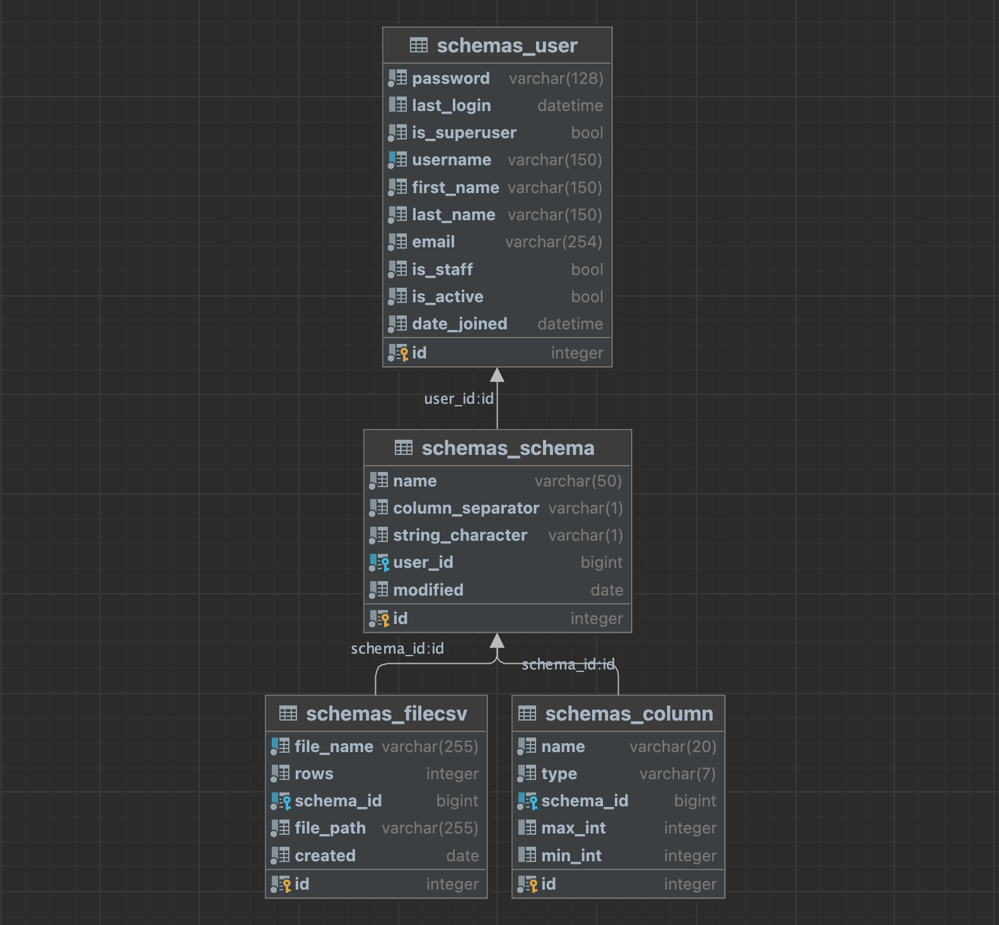

# fake-csv

Django project for generating CSV files with fake (dummy) data using Python and Django

## Check it out!
[FakeCSV project deployed to PythonAnywhere](http://doroshenkomisha.pythonanywhere.com/)
```text
test data:
username: admin
password: edcujm37
```

## Instalation

Python3 must be already installed

```shell
git https://github.com/misha-doroshenko/fake_csv.git
cd fake_csv
python3 -m venv venv
source venv/bin/activate
pip install -r requirements.txt
python manage.py migrate
python manage.py runserver  # starts Django project
```

## Features

* Authentication functionality
* Create schema with a formset
* Dynamically adding form fields
* Save csv files to S3 bucket and download them

## Database structure

